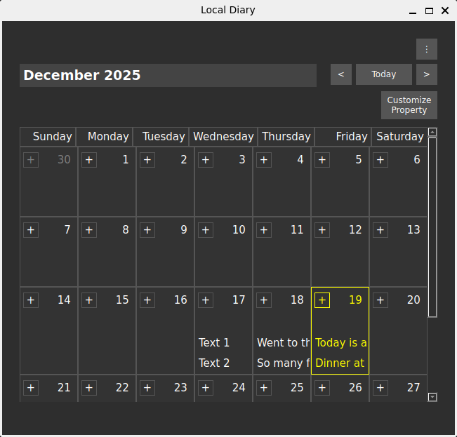
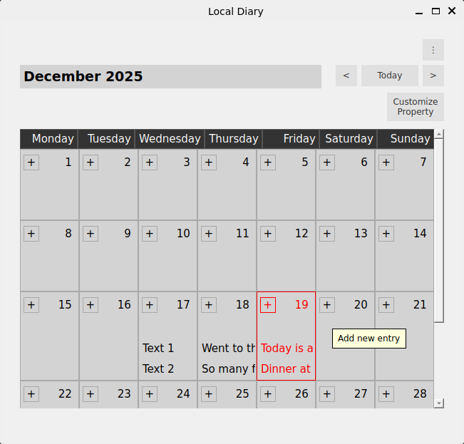
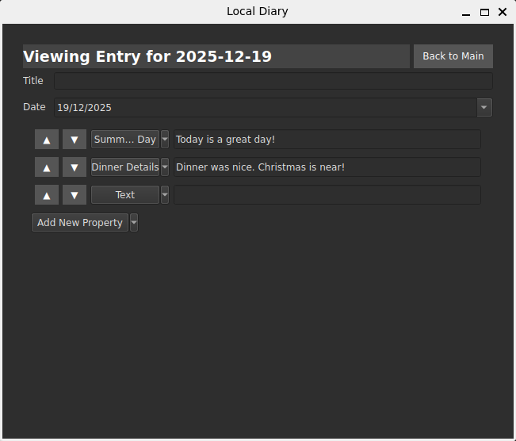
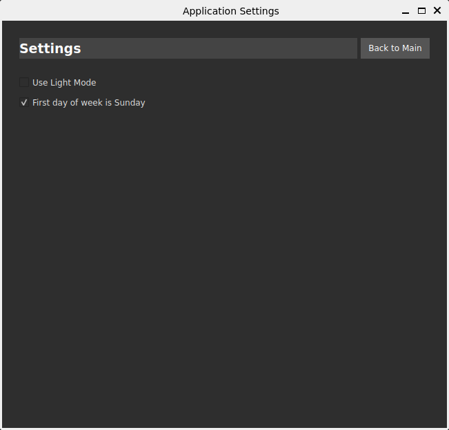

# Local Diary (WIP)
I have been using Notion and part of it is as daily journaling, but recently I have switched to other platforms, yet Notion is still best for daily journaling. Hence this project, it is a lightweight version of Notion for daily journaling.

- This project is made with PYQT6, using json to store its database, similar to Obsidian. 
- You can customize your daily entry, create a template to easily add an entry next time.  
    - For example, use `select` object to easily log your morning mood! 
    - Or a `multiselect` object to log what you have done during the morning that is typical to your routine. 
- The main view is a calendar where you can easily see your past entries based on customization. 

Main view in dark mode:

Main view in light mode:

Typical entry view:

Settings view:

